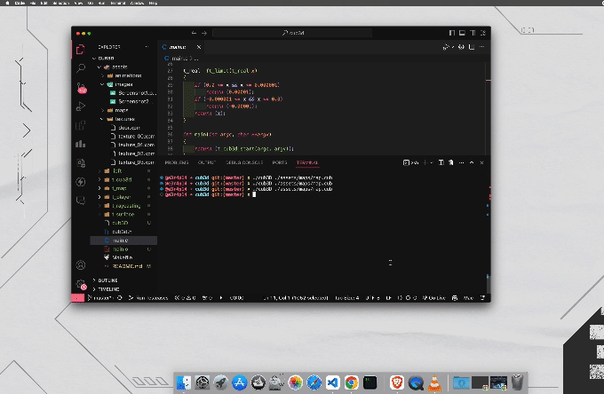
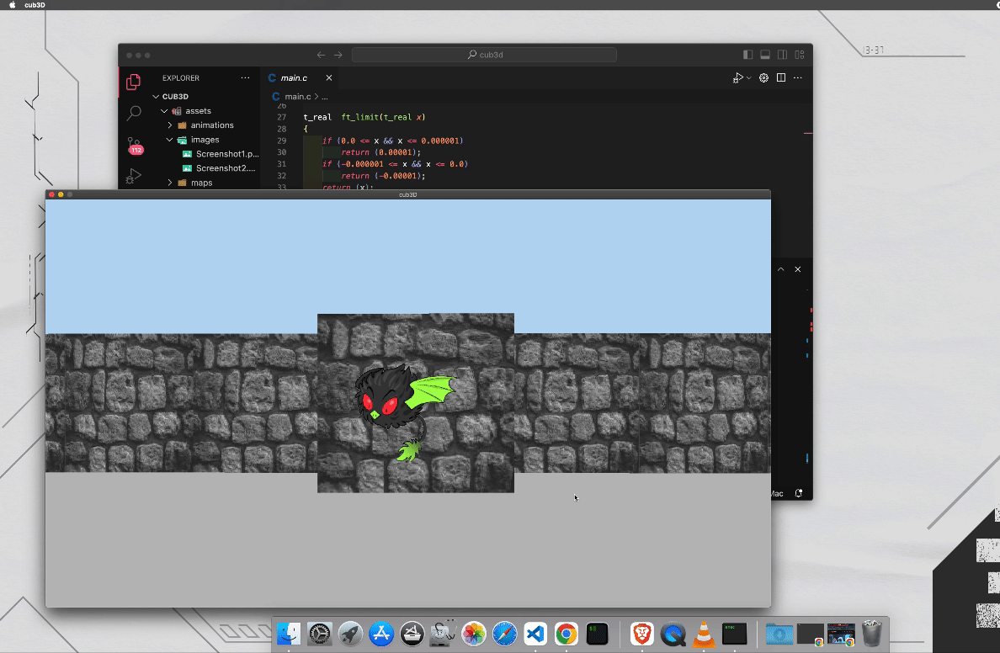

# Cub3D

Cub3D is a project inspired by Wolfenstein 3D, aiming to explore ray-casting techniques to create a dynamic view inside a maze using C and miniLibX.


## Features

- First-person perspective view
- Textured walls and floors
- Configurable map files
- Smooth window management
- Floor and ceiling color customization

## Installation

1. Clone the repository:

    ```sh
    git clone git@github.com:Mtigunit/42-Cub3D.git
    cd 42-Cub3D
    ```

2. Build the project:

    ```sh
    make
    ```

## Usage

Run the game with:

```sh
./cub3D assets/maps/map.cub
```
## Controls

```
W - Move forward
A - Move left
S - Move backward
D - Move right
← - Look left
→ - Look right
ESC - Exit the game
```

## Map Configuration

A valid map file has a .cub extension and contains:
- 0 for empty space.
- 1 for walls.
- N, S, E, W for the player’s start position and orientation.

Example:
```txt
111111
100101
101001
1100N1
111111
```

If the map is misconfigured, the program will exit and display an error message.

## Bonus Part

Bonuses will be evaluated only if your mandatory part is perfect. Bonus list:

- Wall collisions.
- A minimap system.
- Doors which can open and close.
- Animated sprite.
- Rotate the point of view with the mouse.

## Screenshots
Here is some pictures from the game:





